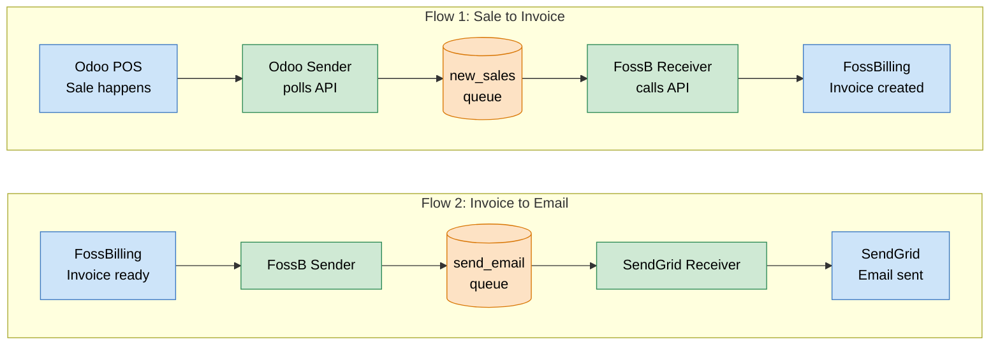

# integration-bridge
 
Spring Boot service that bridges Odoo POS, FossBilling, and SendGrid via RabbitMQ. A sale in Odoo flows through the system as an invoice in FossBilling and ends as an email to the customer.
 
## Architecture
 
The system has two flows. Each flow goes through a RabbitMQ queue so the bridges can fail and retry independently.
 

 
Failed messages are routed to dead-letter queues (`new_sales.dlq`, `send_email.dlq`) after 3 retry attempts with exponential backoff.
 
## What it does
 
When a customer pays at the Odoo POS, the Odoo bridge polls the Odoo API and publishes the sale to RabbitMQ. The FossBilling bridge picks it up, creates an invoice, then publishes the invoice to another queue. The SendGrid bridge receives this and sends an HTML invoice email to the customer.
 
Each step is idempotent. Sales are tracked in Firestore via `ProcessedSalesTracker` to prevent duplicate invoices on overlapping polls or retries. A periodic heartbeat is published to RabbitMQ so a missing service can be detected.
 
## Tech stack
 
- Java 21, Spring Boot 4.0.3
- RabbitMQ for queue-based messaging (XML payloads)
- Jackson `XmlMapper` for XML serialization
- Firebase Firestore for processed-sales tracking
- Lombok for boilerplate reduction
- Docker / Docker Compose for deployment
- JUnit 5 + Mockito for tests
Queue messages are XML, external API calls are JSON. This split is intentional: XML pins the contract between bridges, JSON matches the upstream APIs (Odoo JSON-RPC, FossBilling REST, SendGrid REST).
 
## Modules
 
- `config/` — RabbitMQ queues + retry, Firebase initialization
- `shared/` — `XmlUtils`, `HeartbeatSender`, `ProcessedSalesTracker`, message models
- `exception/` — `ApiException`, `XmlSerializationException`
- `odoo/`, `fossbilling/`, `sendgrid/` — one package per bridge
## Running locally
 
Set the environment variables for RabbitMQ, Odoo, FossBilling, and SendGrid in your IDE's run configuration. Place the Firebase service account JSON at `src/main/resources/firebase-key.json`. Then run with `mvn spring-boot:run`.
 
See `.env.example` for the variables. The defaults in `application.properties` cover local-dev fallback values.
 
## Running on the VM
 
The bridge runs as one service in the VM's Docker Compose stack alongside RabbitMQ, Odoo, and FossBilling. The compose file mounts the Firebase credentials as a read-only volume.
 
To deploy a new version: pull the latest code on the VM, then rebuild and restart the `integration-bridge` service via Docker Compose.
 
## Error handling
 
- `ApiException` — external API failure; retryable.
- `XmlSerializationException` — malformed XML; routed to DLQ.
- `IllegalArgumentException` — invalid input; routed to DLQ.
Spring's `RabbitListenerContainerFactory` retries 3 times with exponential backoff before routing to the DLQ. `ProcessedSalesTracker` falls back to in-memory mode if Firestore is unreachable. `HeartbeatSender` logs and swallows failures so a broken broker never crashes the scheduler.
 

## Team
 
| Member | Responsibility |
|---|---|
| Assaad Assaad | Shared utilities, integration ownership, code reviews |
| AHMAD SAQIB Shan | FossBilling bridge |
| AZAR George | SendGrid bridge |
| LE NASSR Saba | Odoo bridge |
| MARASLI Musa | Infrastructure (RabbitMQ, Docker, CI/CD) |
